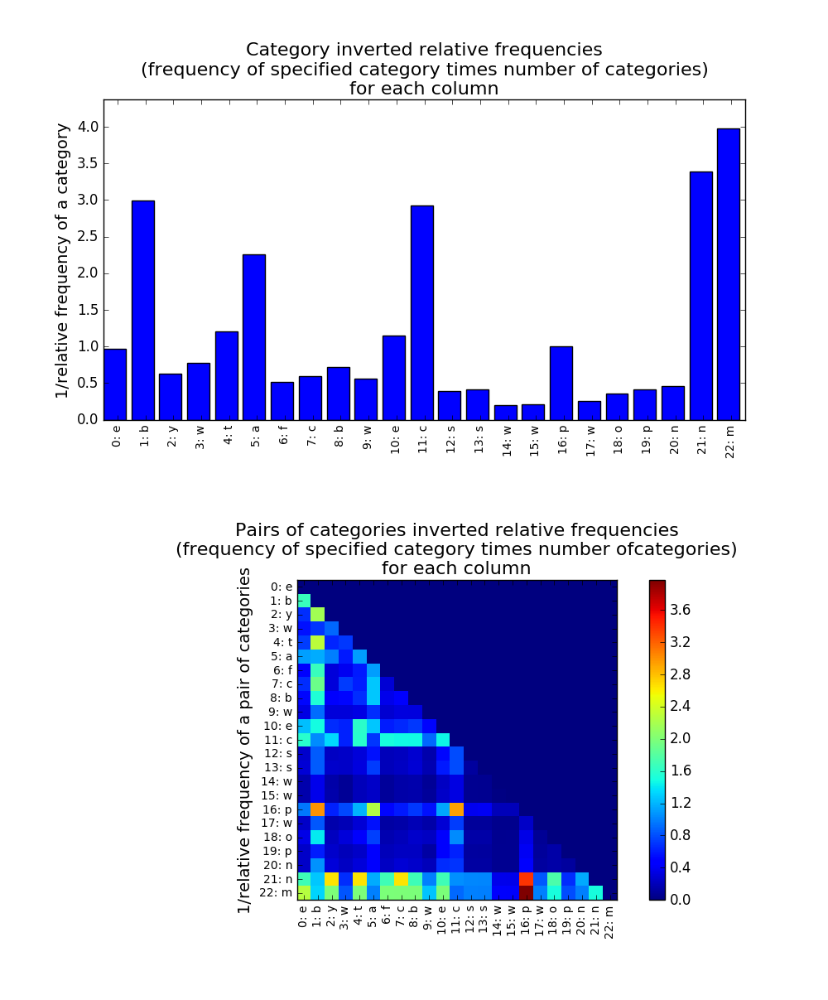

## Examples

```python
from sibyl import *
import wget

# Read the mushroom dataset from UC Irvine Dataset Repository
url = 'https://archive.ics.uci.edu/ml/machine-learning-databases/mushroom/agaricus-lepiota.data'
filename = wget.download(url)
mushroom_data = pandas.read_csv(filename,header = None)

# Return anomaly score for every sample in the dataset, sample 50 times and include 100 instances in each sample
mushroom_sibyl = Sibyl(mushroom_data)
score_vec = mushroom_sibyl.score_dataset(50, 100)

# Index of the instance that has the highest anomaly score
anomaly_score_highest = score_vec.argmax()
max_anomaly_score = mushroom_sibyl.score_instance(anomaly_score_highest, 50, 100)

# To check the most important features and pair of features for that instance
print(mushroom_sibyl.get_feature_importance(anomaly_score_highest))
# outputs: most important single feature, and most important feature-pairs, in terms of contribution to the total anomaly score for the instance with the index "anomaly_score_highest"
'''
{'single feature': ([22], 3.9745596868884547), 'pair features': ([(16, 22)], 3.9745596868884547)}
'''

# For further inspection of other features and feature-pairs in terms of contribution to the total anomaly score: *instance_inspect* returns the contribution of each single feature, and feature-pair, in the total anomaly score for a specific instance.
mushroom_sibyl.instance_inspect(anomaly_score_highest, plot=True)

```

For the example above, *instance_inspect* produces the following plot:



The figure above, shows a bar plot of each feature (and pair of features) vs its inverse relative frequency. The relative frequency for a feature is the frequency of that feature multiplied by the number of values that feature takes.

The upper part of the figure represents this inverse relative frequency for each single feature. From this plot it is clear that the 22nd feature contributes the most to the anomaly score based on single features.

The lower part of this figure shows that the pair of features (16,22) contributes the most to the anomaly score, that is calculated based on pairs of features. That pair is followed by (16,21), and so on.
